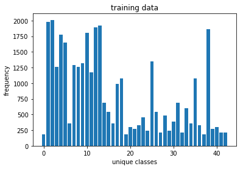
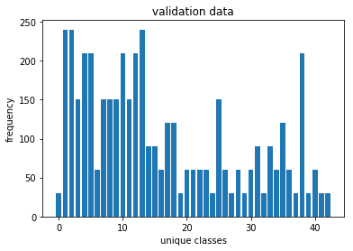
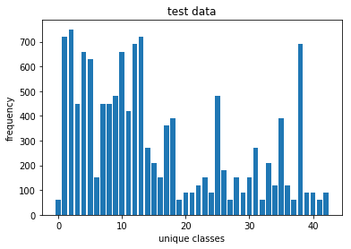
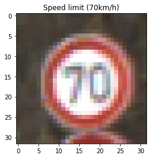
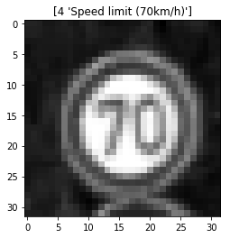
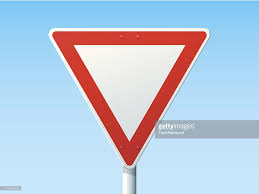
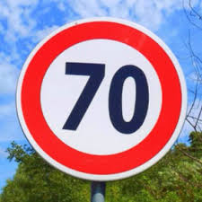

# **Traffic Sign Recognition** 

---
### Writeup / README


#### 1. Provide a Writeup / README that includes all the rubric points and how you addressed each one. You can submit your writeup as markdown or pdf. You can use this template as a guide for writing the report. The submission includes the project code.

You're reading it! and here is a link to my [project code](https://github.com/AmeyaWagh/CarND_Traffic_Sign_Classifier_Project/blob/master/Traffic_Sign_Classifier.ipynb)
I have also implemented this project with the state of the art YOLO v2 by transfer learning on pretrained network. [YOLO project](https://github.com/AmeyaWagh/Traffic_sign_detection_YOLO)

### Data Set Summary & Exploration

#### 1. Provide a basic summary of the data set. In the code, the analysis should be done using python, numpy and/or pandas methods rather than hardcoding results manually.


| Description           		 						   | Value  					|
|:--------------------------------------------------------:|:---------------------------|
| The size of training set is    						   | 34799					 	|
| The size of the validation set is 					   | 4410 				     	|
| The size of test set is 								   | 12630 				     	|
| The shape of a traffic sign image is 					   | (34799, 32, 32, 3) 		|
| The number of unique classes/labels in the data set is   | 43 				     	|


#### 2. Include an exploratory visualization of the dataset.

Here is an exploratory visualization of the data set. It is a bar chart showing how the data ...

 
 


---
### Design and Test a Model Architecture

#### 1. Describe how you preprocessed the image data. What techniques were chosen and why did you choose these techniques? Consider including images showing the output of each preprocessing technique. Pre-processing refers to techniques such as converting to grayscale, normalization, etc. (OPTIONAL: As described in the "Stand Out Suggestions" part of the rubric, if you generated additional data for training, describe why you decided to generate additional data, how you generated the data, and provide example images of the additional data. Then describe the characteristics of the augmented training set like number of images in the set, number of images for each class, etc.)


To reduce the size of the network, the image is converted to gray scale. An RGB image can also be trained to trained by changing layer dimensions to incorporate 3 channels.
To further add, the image is preprocessed to have zero mean and normalized to have values between -1.0 to 1.0. This sppeds up training process. Further more batch normalization can be done. 
The data set is shuffled before training to avoid bias in the network





#### 2. Describe what your final model architecture looks like including model type, layers, layer sizes, connectivity, etc.) Consider including a diagram and/or table describing the final model.

My final model consisted of the following layers:

| Layer         		|     Description	        					| 
|:---------------------:|:---------------------------------------------:| 
| Input         		| 32x32x1 normalized gray scale image   		| 
| Convolution 3x3     	| 1x1 stride, VALID padding, outputs 32x32x64 	|
| RELU					|												|
| Max pooling	      	| 2x2 stride,  outputs 16x16x64 				|
| Convolution 3x3     	| 1x1 stride, VALID padding, outputs 32x32x64 	|
| RELU					|												|
| Max pooling	      	| 2x2 stride,  outputs 16x16x64 				|
| Convolution 3x3     	| 1x1 stride, VALID padding, outputs 32x32x64 	|
| RELU					|												|
| Max pooling	      	| 2x2 stride,  outputs 16x16x64 				|
| Flatten			    | etc.      									|
| Fully connected		| etc.        									|
| Softmax				| etc.        									|
 
##### The full model architecture is as follows:
```python

 def create_model(self):
        ''' LeNet model '''
        cnn_layer_1 = self.CNN_layer(self.X,_shape=(5,5,1,48),_strides=[1, 1, 1, 1])
        pool_1 = self.pooling_layer(cnn_layer_1,_ksize=[1,2,2,1],_stride=[1,2,2,1])
        
        
        cnn_layer_2 = self.CNN_layer(pool_1,_shape=(5,5,48,96),_strides=[1, 1, 1, 1])
        pool_2 = self.pooling_layer(cnn_layer_2,_ksize=[1,2,2,1],_stride=[1,2,2,1])
        
        
        cnn_layer_3 = self.CNN_layer(pool_2,_shape=(3,3,96,172),_strides=[1, 1, 1, 1])
        pool_3 = self.pooling_layer(cnn_layer_3,_ksize=[1,2,2,1],_stride=[1,1,1,1])
        
        flattened = self.flattened_layer(pool_3)
        
        fc_1 = self.fully_connected_layer(flattened,_shape = (688,84))
        self.logits = self.fully_connected_layer(fc_1,_shape = (84,self.n_classes), 
                                          activation=False)
        
        
        self.accuracy_check = tf.reduce_mean(tf.cast(
            tf.equal(tf.argmax(self.logits,1) , tf.argmax(self.y_one_hot,1)), tf.float32))
        
        return self.adam_optimizer(self.logits)
```

where the layers were designed keeping Keras in mind
##### CNN layer 
```python
def CNN_layer(self,X,_shape=(5,5,1,6),_strides=[1, 1, 1, 1]):
        ''' convolution layer ''' 
        conv_wt = tf.Variable(tf.truncated_normal(shape=_shape,
                                                  mean=self.mu,
                                                  stddev=self.stddev))
        conv_bias = tf.Variable(tf.zeros([_shape[3]]))
        conv = tf.nn.conv2d(X,conv_wt,strides=_strides, padding = 'VALID') + conv_bias
        ''' activation ''' 
        output = tf.nn.relu(conv)
        return output

```

##### pooling layer
```python
def pooling_layer(self, X, _ksize=[1,2,2,1], _stride=[1,2,2,1]):
        ''' Pooling Layer '''
        pooling = tf.nn.max_pool(X, ksize=_ksize, strides=_stride, padding='VALID')
        return pooling
```

##### fully connected layer
```python
def fully_connected_layer(self,X,_shape=(688,84),activation=True):
        ''' Fully connected layer '''
        fc_weights = tf.Variable(tf.truncated_normal(shape = _shape, 
                                                     mean = self.mu , 
                                                     stddev = self.stddev))
        fc_bias = tf.Variable(tf.zeros(_shape[1]))
        fc_layer = tf.matmul(X,fc_weights) + fc_bias
        if activation:
            return tf.nn.relu(fc_layer)
        else:
            return fc_layer
```


#### 3. Describe how you trained your model. The discussion can include the type of optimizer, the batch size, number of epochs and any hyperparameters such as learning rate.

LeNet model was made scalable and reusable to fit the API style of sci-kit learn.

```python
EPOCHS = 15
BATCH_SIZE = 128
LEARNING_RATE=0.001

le_net = LeNetClassifier(n_classes,learning_rate=LEARNING_RATE)

le_net.fit(n_classes,EPOCHS,BATCH_SIZE,
           X_train,y_train,X_valid, y_valid)

le_net.evaluate(X_train,y_train,X_test,y_test)
```

As Adam optimizer was used, a general practise is to use a learning rate of <strong>0.001</strong> which is observed to have a faster convergence with low loss
batch size and epochs were finalized by trial and error approach. the accuracy starts to saturate after 15 epochs 

#### 4. Describe the approach taken for finding a solution and getting the validation set accuracy to be at least 0.93. Include in the discussion the results on the training, validation and test sets and where in the code these were calculated. Your approach may have been an iterative process, in which case, outline the steps you took to get to the final solution and why you chose those steps. Perhaps your solution involved an already well known implementation or architecture. In this case, discuss why you think the architecture is suitable for the current problem.

LeNet architecture is a pretty fundamental model of convolutional neural networks. It works very well with MNIST dataset with image size of 32x32. The traffic signs were preprocessed and reshaped to the same size and trained to obtain an accuracy of more than 93%. 


##### My final model results:
| Description           		 						   | Value  					|
|:--------------------------------------------------------:|:---------------------------|
| training set accuracy of     						   	   | 34799					 	|
| validation set accuracy of 					           | 4410 				     	|
| test set accuracy of 					                   | (34799, 32, 32, 3) 		|

<!-- If an iterative approach was chosen:
* What was the first architecture that was tried and why was it chosen?
* What were some problems with the initial architecture?
* How was the architecture adjusted and why was it adjusted? Typical adjustments could include choosing a different model architecture, adding or taking away layers (pooling, dropout, convolution, etc), using an activation function or changing the activation function. One common justification for adjusting an architecture would be due to overfitting or underfitting. A high accuracy on the training set but low accuracy on the validation set indicates over fitting; a low accuracy on both sets indicates under fitting.
* Which parameters were tuned? How were they adjusted and why?
* What are some of the important design choices and why were they chosen? For example, why might a convolution layer work well with this problem? How might a dropout layer help with creating a successful model?

If a well known architecture was chosen:
* What architecture was chosen?
* Why did you believe it would be relevant to the traffic sign application?
* How does the final model's accuracy on the training, validation and test set provide evidence that the model is working well? -->

 

### Test a Model on New Images

#### 1. Choose five German traffic signs found on the web and provide them in the report. For each image, discuss what quality or qualities might be difficult to classify.

Here are five German traffic signs that I found on the web:

  
 

These few of these images have watermarks and also have some affine transformations like rotation and flattened. The classifier still does a good job of classifying these unknown images. 

#### 2. Discuss the model's predictions on these new traffic signs and compare the results to predicting on the test set. At a minimum, discuss what the predictions were, the accuracy on these new predictions, and compare the accuracy to the accuracy on the test set (OPTIONAL: Discuss the results in more detail as described in the "Stand Out Suggestions" part of the rubric).

Here are the results of the prediction:

| Image			        							|     Prediction	        					| 
|:-------------------------------------------------:|:---------------------------------------------:| 
| Right-of-way at the next intersection      		| Right-of-way at the next intersection  		| 
| Stop     											| Stop 											|
| Yield												| Yield											|
| Speed limit (70km/h)	      						| Speed limit (70km/h)					 		|
| Speed limit (30km/h)								| Speed limit (50km/h)      					|


It can be seen from the tables below that all the images are classified correctly with almost 99% confidence except <strong>Speed limit (30km/h)</strong> which is classified as <strong>Speed limit (50km/h)</strong>

#### 3. Describe how certain the model is when predicting on each of the five new images by looking at the softmax probabilities for each prediction. Provide the top 5 softmax probabilities for each image along with the sign type of each probability. (OPTIONAL: as described in the "Stand Out Suggestions" part of the rubric, visualizations can also be provided such as bar charts)


##### Predictions for 5 images and their maximum confidences

| Probability         	|     Predicted Labels	        					
|:---------------------:|:---------------------------------------------: 
| 1.00         			| Right-of-way at the next intersection   		 
| 0.999995     			| Stop 											
| 1.0					| Yield											
| 0.999917	      		| Speed limit (70km/h)					 		
| 0.90177				| Speed limit (50km/h)      					


##### Image 1. Right-of-way at the next intersection


| predictions 												   | Probabilities	 
|:------------------------------------------------------------:|:---------------:
|Right-of-way at the next intersection                         | 1.0			 
|Pedestrians                                                   | 3.2227e-15		 
|Double curve                                                  | 4.55075e-17	 
|Roundabout mandatory                                          | 1.11581e-17	 
|Go straight or left                                           | 5.25451e-18	 


##### Image 2. Stop


| predictions 												   | Probabilities	 
|:------------------------------------------------------------:|:---------------:
|Stop                                                          | 0.999995		 
|Turn left ahead                                               | 1.9348e-06		 
|Go straight or left                                           | 1.20174e-06	 
|Keep left                                                     | 9.13656e-07	 
|Turn right ahead                                              | 2.61988e-07	 


##### Image 3. Yield


| predictions 												   | Probabilities	 
|:------------------------------------------------------------:|:---------------:
|Yield                                                         | 1.0			 
|Speed limit (30km/h)                                          | 5.39172e-31	 
|Speed limit (50km/h)                                          | 6.28297e-34 	 
|End of no passing by vehicles over 3.5 metric tons            | 4.54861e-34	 
|Ahead only                                                    | 2.21658e-34 	 


##### Image 4. Speed limit (70km/h)


| predictions 												   | Probabilities	 
|:------------------------------------------------------------:|:---------------:
|Speed limit (70km/h)                                          | 0.999917		 
|Speed limit (20km/h)                                          | 8.32727e-05	 
|Keep left                                                     | 1.60437e-07	 
|Speed limit (30km/h)                                          | 4.06573e-10 	 
|Speed limit (80km/h)                                          | 2.2947e-14		 


##### Image 5. Speed limit (30km/h)


| predictions 												   | Probabilities	 
|:------------------------------------------------------------:|:---------------:
|Speed limit (50km/h)                                          | 0.90177		 
|Speed limit (30km/h)                                          | 0.0982267		 
|Keep right                                                    | 3.6065e-06		 
|Speed limit (20km/h)                                          | 4.38543e-08	 
|Go straight or left                                           | 1.30004e-09	 


